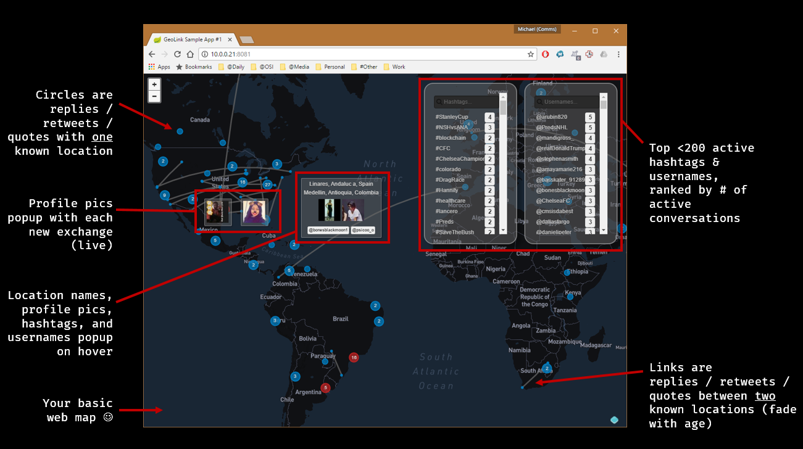
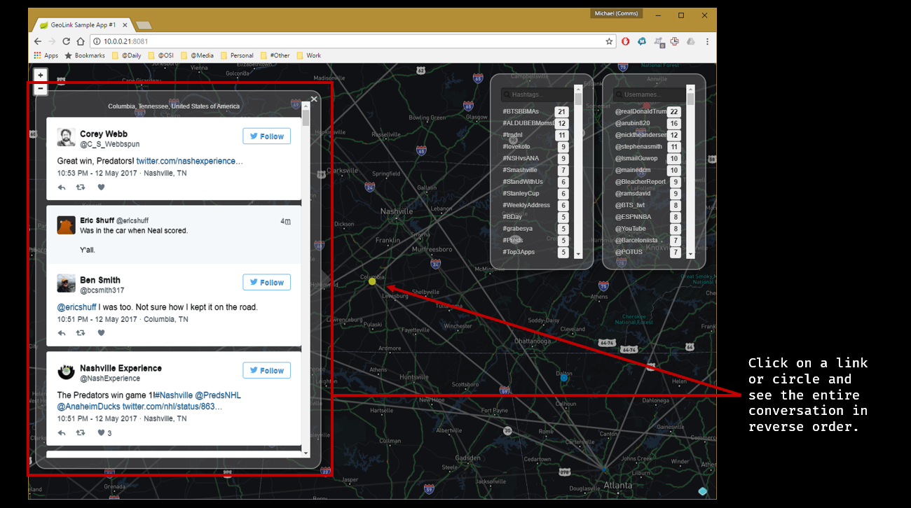
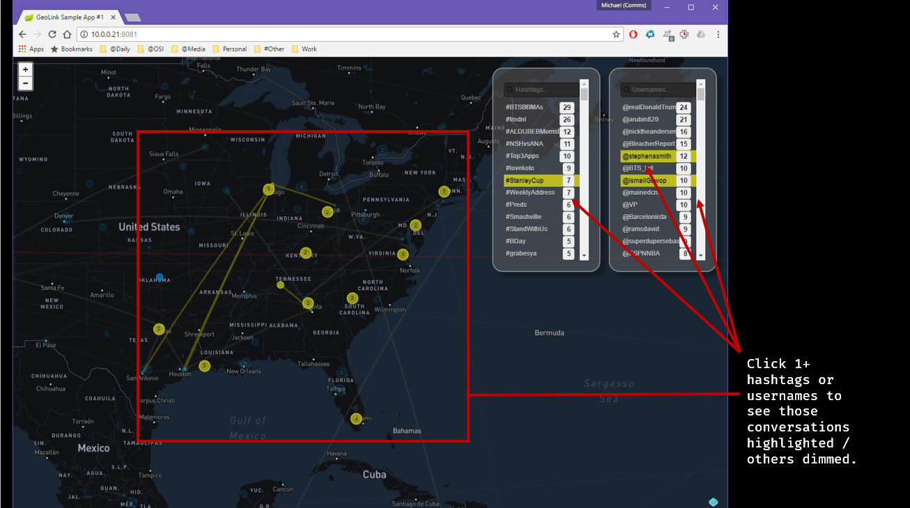
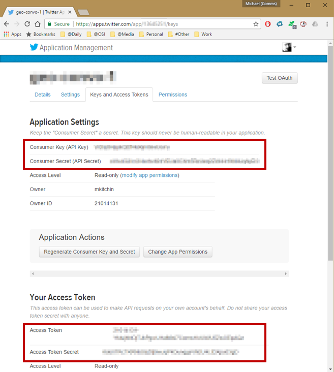
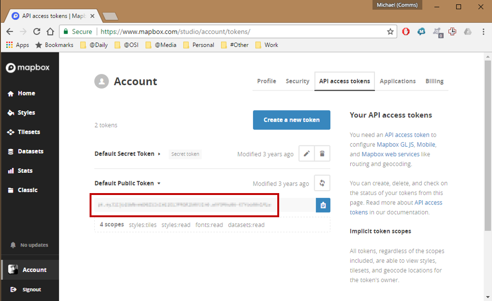
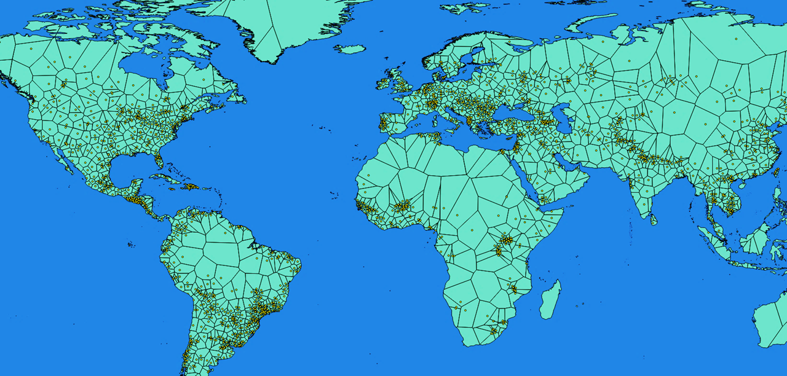

# geo-convo-server
Twitter conversation scanning and mapping tool, made with SpringBoot, Kotlin, OpenLayers3 and jQuery Mobile.

Uses websockets for continuous, low-overhead updates and geospatial bucketing for (somewhat) decluttered presentation.

This is POC-level code (hence, shit for comments).
# Features
In terms of the UX:






# Getting Started

## Tools
New-ish Linux, Windows, or Mac OS.

[Download/install Java 8 SDK.](http://www.oracle.com/technetwork/java/javase/downloads/index.html)

[Download/install Apache Maven.](https://maven.apache.org/download.cgi)

Ensure both are in your working path.

## Create Twitter App

You'll need to [create a Twitter app](https://apps.twitter.com/) (quick/free), then get app and user keys/secrets in order to build or run the software.

Twitter app management page with the important parts highlighted:


## Create Mabpox Account
 
You'll need to [create a Mapbox account](https://www.mapbox.com/signup/) (quick/free), then get a public token to run the software.  

Mapbox account management page with the important parts highlighted:

 
# Building

## Perquisites

### Update src/main/resources/application.yml
Fill out Twitter keys/secrets obtained above, per instructions at top of file.
 
### Update src/main/resources/static/app.js
Fill out Mapbox token obtained above, per instructions at top of file.

## (Actually) Build
In bash/cmd:
```Bash
$ cd <path-to-source-folder>
$ mvn clean package
```

You may build with tests disabled if you'd rather not embed Twitter keys/secrets, as follows:
```Bash
$ cd <path-to-source-folder>
$ mvn clean package -DskipTests
```

This generates a JAR file of the following form:
```Bash
target/geo-convo-server-<version>-<snapshot-or-release>.jar
```
E.g. (used in examples below):
```Bash
target/geo-convo-server-0.0.1-SNAPSHOT.jar
```

# Deploying
1. Copy generated JAR file to wherever it's to be deployed.
1. Copy `data` folder to to the same location.
1. (Optionally) Copy `appplication.yml`, referenced above to the same location to override embedded settings (e.g., Twitter keys/secrets).

# Running
In bash/cmd:
```Bash
$ cd <path-to-run-folder>
$ java -jar geo-convo-server-0.0.1-SNAPSHOT.jar
```
It's fine to run from the source folder, as follows:
```Bash
$ cd <path-to-source-folder>
$ java -jar target/geo-convo-server-0.0.1-SNAPSHOT.jar
```

# Using
Navigate to the following URL:
```Bash
http://localhost:8080
```

If all tokens/secrets have been set correctly, the map will be visible and coversations will begin to appear within a minute (expect >60/min, bandwidth depending).

# Metrics
Metrics (e.g., total received Tweets) in JSON form may be obtained via the following URL:
```Bash
http://localhost:8080/metrics
```

Username/password are specified in the `application.yml` file, referenced above.

Example:

```Javascript
{
  "mem": 1499474,
  "mem.free": 678824,
  "processors": 12,
  "instance.uptime": 771214,
  
// [...]

  "counter.services.publisher.points.published": 1654,
  "counter.services.links.tweets.new": 37434,
  "counter.services.status.request.enqueued": 9255,
  "counter.services.location.features.known": 1243,
  "counter.services.links.tweets.replies": 5605,
  "counter.services.trends.requests.trends": 77,
  "counter.services.links.tweets.source.location.known": 36604,
  "counter.services.links.tweets.target.location.unknown": 1014,
  "counter.services.locations.total.known": 12619,
  "counter.services.twitter.limit.waits": 1,
  "counter.services.status.request.loaded": 873,
  "counter.services.appcontroller.requests.startup": 2,
  "counter.services.links.tweets.source.location.unknown": 830,
  "counter.services.publisher.messages.published": 486,
  "counter.services.links.tweets.duplicate": 435,
  "counter.services.status.request.cached": 9731,
  "counter.services.links.total.known": 58,
  "counter.services.links.tweets.target.location.known": 336,
  "counter.services.publisher.ends.published": 200,
  "counter.services.publisher.links.published": 100,
  "counter.services.links.tweets.chained": 14,
  "counter.services.links.tweets.quotes.1": 4126,
  "counter.services.links.total.unknown": 374,
  "counter.services.trends.requests.places": 2
}
```

# Geospatial Bucketing
In an effort to collate Tweets to/from from approximate locations I used the Natural Earth Populated Places dataset and qGIS to generate the following Voronoi (Thiessen) polygons:


This represents ~2000 cities from the original dataset, selected by `SCALERANK` and `RANK_MIN` (population) values.  

The `LocationsService` in the software matches Tweet locations against these polygons, then groups matched Tweets at the latitude/logitude of the related city.

These polygons are stored in a shapefile referenced in the `application.yml` file and may be modified to provide differently-distributed circles and link endpoints.  

# References
## Main Elements
- [SpringBoot](https://projects.spring.io/spring-boot/)
- [Kotlin](https://kotlinlang.org/)
- [OpenLayers3](https://openlayers.org/)
- [jQuery Mobile](https://jquerymobile.com/)

## Supporting APIs
- [Twitter4j](http://twitter4j.org/en/)
- [GeoTools](http://www.geotools.org/)

## Other
- [NaturalEarth Populated Places](http://www.naturalearthdata.com/downloads/10m-cultural-vectors/10m-populated-places/)
- [qGIS](http://www.qgis.org)
